# Syn

**A self-hosted OpenAI-compatible inference gateway and control plane for private/local LLM infrastructure.**

Syn sits between your applications and private inference backends (llama.cpp), exposing a single OpenAI-compatible API while handling authentication, admission control, concurrency, usage accounting, observability, and model/backend routing. The actual LLM inference stays on the local backend; Syn is the control layer around it.

```text
Applications / Agents
        │
        ▼
OpenAI-compatible API  (/v1/chat/completions)
        │
        ▼
Syn Gateway  (127.0.0.1:8001)
        │
  ┌─────┼──────────────────────────────┐
  │     │                              │
Auth   Policy  Admission  Usage   Routing  Observability
  │     │                              │
  └─────┼──────────────────────────────┘
        │
        ▼
Private inference backend  (llama.cpp 127.0.0.1:8080)
        │
        ▼
Local GPU
```

---

## Why "Syn"?

The name reflects the project’s role: a **synchronization / connection layer** between systems. Syn keeps the moving parts of a private inference deployment in lockstep — applications, API clients, model identities, backend runtimes, policy, observability, and the local GPU. It is the synchronizing gateway between your code and the model server.

---

## What Syn IS

- An inference **gateway** and control plane
- An **OpenAI-compatible API facade**
- An **authentication / authorization** boundary
- An **admission-control** layer
- A **request scheduling** layer
- A **usage-accounting** layer
- An **observability** layer
- A **backend / model abstraction** layer

## What Syn IS NOT

- An inference engine (llama.cpp does the inference)
- A replacement for llama.cpp
- A model-training system
- A RAG framework
- An agent framework
- A GPU-virtualization platform
- A complete clone of the OpenAI API
- A Kubernetes / distributed system (single process by design)

---

## Architecture

Syn is a FastAPI application structured into clearly bounded layers:

```text
app/
├── api/              — HTTP routes (data plane /v1/*, management /admin/*)
├── auth/             — API-key auth, admin-secret auth
├── backends/         — backend abstraction (llama.cpp adapter lives here)
├── routing/          — canonical model IDs, aliases, backend registry
├── observability/    — latency, tokens, outcomes, recent requests
├── models/           — SQLAlchemy ORM (users, clients, API keys)
├── core/             — config, errors, SSE parsing, security primitives
├── templates/        — self-contained admin UI (admin_base.html)
└── main.py           — FastAPI app entrypoint
config/               — routing.json (multi-backend mapping)
scripts/              — start_syn.ps1, stop_syn.ps1 (one-click launcher)
tests/                — pytest suite (no GPU / no llama.cpp / no network required)
```

Full trust-boundary discussion in [`docs/ARCHITECTURE.md`](docs/ARCHITECTURE.md).

---

## What problem it solves

Running a local LLM today usually means:

- Hand-rolling auth around an inference server
- No view of who used what, when, or how much
- No central way to manage multiple clients/keys
- No retry/concurrency policy
- Exposing the inference server directly to applications

Syn wraps a private llama.cpp instance with the production concerns (auth, policy, observability, quota, routing) and exposes the same OpenAI SDK contract that applications already expect. The inference server stays loopback-only and protected.

---

## Key features

- **OpenAI-compatible API** on `/v1/chat/completions` (streaming + non-streaming)
- **Multi-model / multi-backend routing** with canonical model IDs and aliases
- **API-key lifecycle** — create, list, rotate, revoke from the UI
- **Admission control** — active/queued limits, queue timeout
- **Rate limits and quotas** — requests/min, requests/day, tokens/day, identity-based
- **Observability** — latency (avg/p50/p95), TTFT, token counts, recent requests
- **Admin Control Plane** — browser-based UI, 10 sections, themed (light/dark)
- **Runtime model detection** — distinguishes "configured" from "actually loaded"
- **One-click launcher** for Windows (llama.cpp + Syn + Cloudflare Quick Tunnel)
- **Cloudflare Quick Tunnel** for temporary remote HTTPS access (M8, in progress)
- **Single shared admin secret** (not a full RBAC system) for the management plane

---

## Admin Control Plane

A self-contained browser UI at `http://127.0.0.1:8001/admin/ui`. The operator enters the admin secret in-browser; the secret stays in JS memory and is sent as `X-Admin-Secret` on subsequent API requests. Never embedded in HTML, never persisted to `localStorage`/`sessionStorage`.

### Sections

| # | Section | Purpose |
|---|---------|---------|
| 1 | **Overview** | Service health, runtime inference summary, request/token/latency aggregates |
| 2 | **Users** | Manage Syn account owners |
| 3 | **Clients** | Applications / devices using the gateway |
| 4 | **API Keys** | Credentials issued to clients (create / rotate / revoke) |
| 5 | **Models** | Canonical Syn models with runtime detection |
| 6 | **Backends** | Backend health, server version, loaded model list |
| 7 | **Routing** | Preview model → backend resolution |
| 8 | **Usage** | Request and token consumption |
| 9 | **Observability** | Recent inference activity with client-side filters |
| 10 | **Settings** | Read-only runtime configuration |

---

## Runtime Model Detection

Syn does **not** assume that a configured/enabled model is currently running. The Models page distinguishes between:

- **Configuration** (`enabled` flag from routing config) — what the operator set up
- **Runtime** (real-time backend probe) — what the backend is actually serving

For every configured model, Syn resolves its `backend_id`, performs a fresh health probe, and queries the backend’s runtime model list. The result is a runtime status:

| Status | Meaning |
|--------|---------|
| `ONLINE` | Backend reachable AND a real model discovered |
| `OFFLINE` | Backend unreachable |
| `NO_MODEL` | Backend reachable but no model discovered |
| `ERROR` | Probe or discovery raised an exception |

`enabled=true` is a **configuration** flag. A model is `ONLINE` only when the backend is actually reachable and an actual model is discovered at runtime. If a backend is started/stopped while Syn is running, refreshing the Models page reflects the new state — no Syn restart required.

Models page columns:

```
Syn Model    Runtime Model            Backend   Aliases    Config      Runtime
model-a      gpt-oss-20b-Q4_K_M.gguf  backend-a  alias-a    ENABLED     ONLINE
model-b      Not loaded               backend-b  alias-b    ENABLED     OFFLINE
```

GGUF full filesystem paths are sanitized to basenames only — the UI never displays the private model path.

---

## Screenshots

### Overview

Gateway health, routing, and the local inference summary card showing the actual loaded model discovered from llama.cpp.

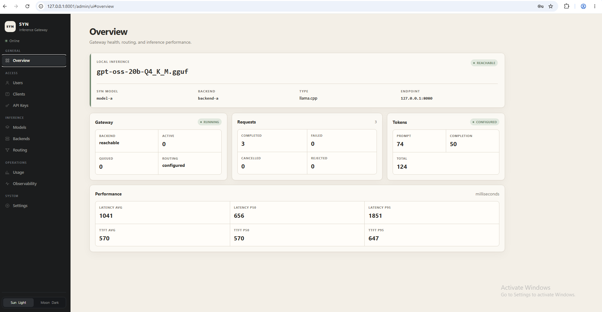

### Runtime Models

Canonical Syn models with distinct `Config` and `Runtime` columns. The runtime column reflects real backend probes, not static configuration.

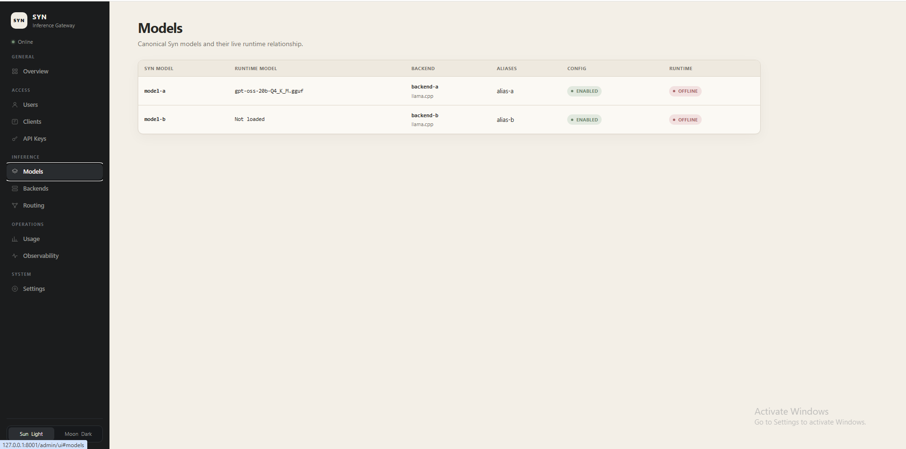

### Backend Health

Each backend shows reachability, type, server version, loaded model, last-checked timestamp, and mapped Syn models.

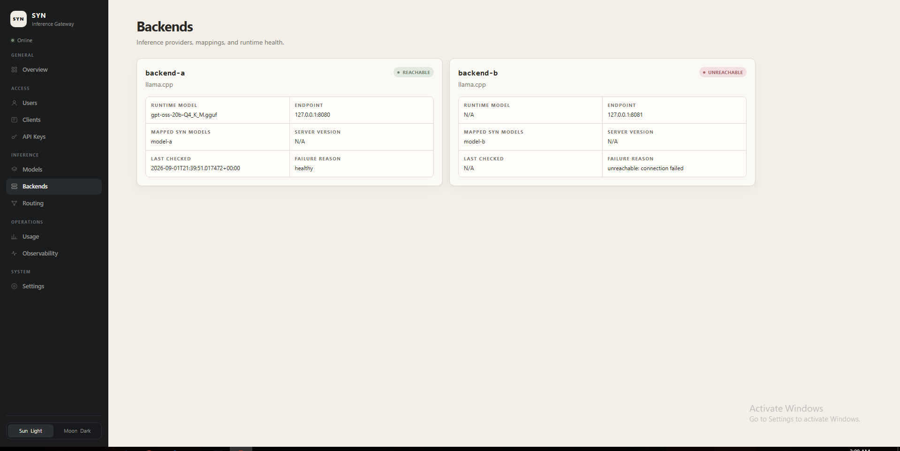

### Routing Preview

Resolve a requested model (canonical or alias) to its configured backend and the backend-native runtime model.

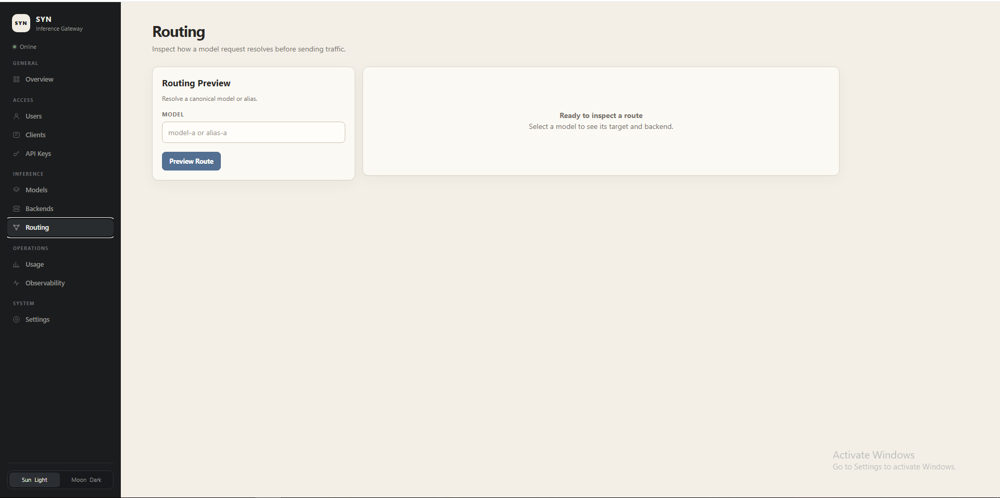

### Usage

Request outcomes and token aggregates broken into two grouped cards.

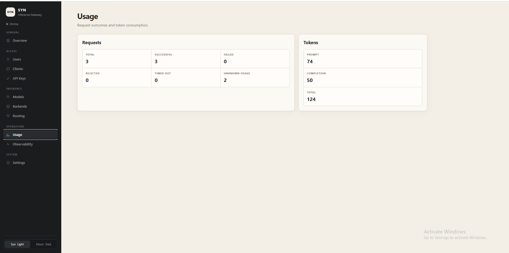

### Observability

Recent inference activity with client-side filters for model and status. No prompt/response content is stored.

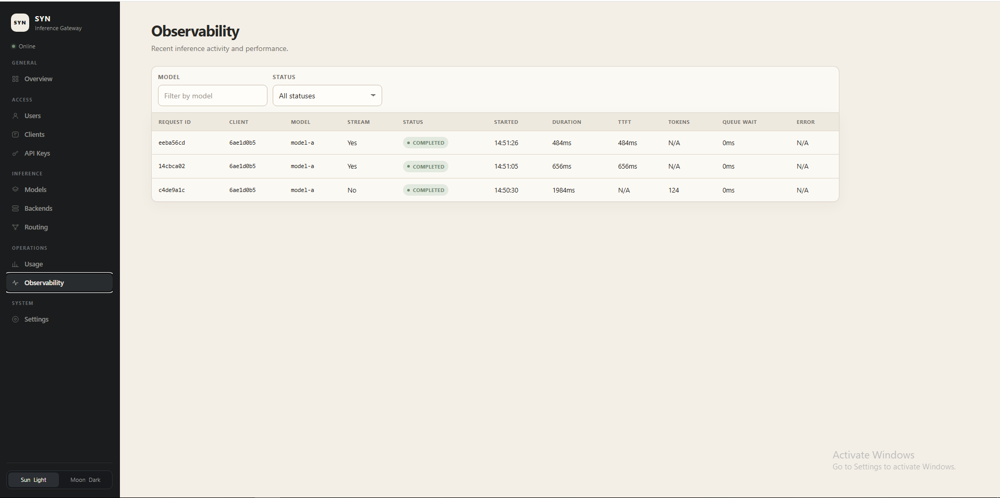

### Access Management

Users:

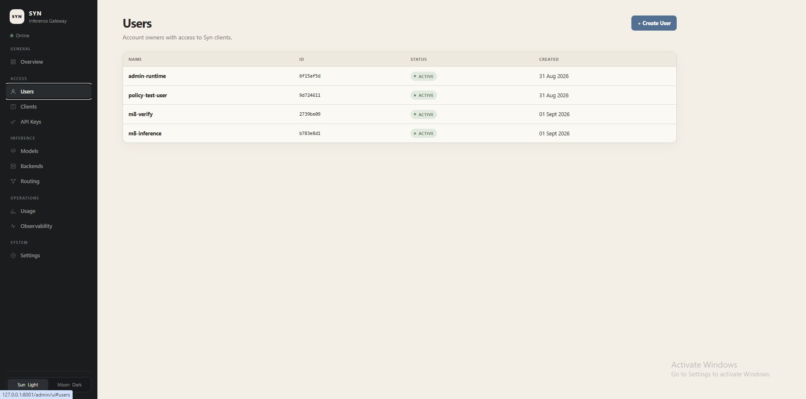

Clients:

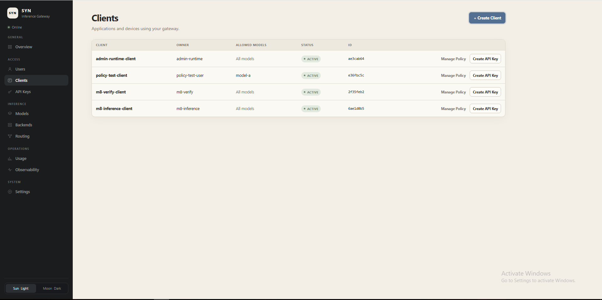

API Keys:

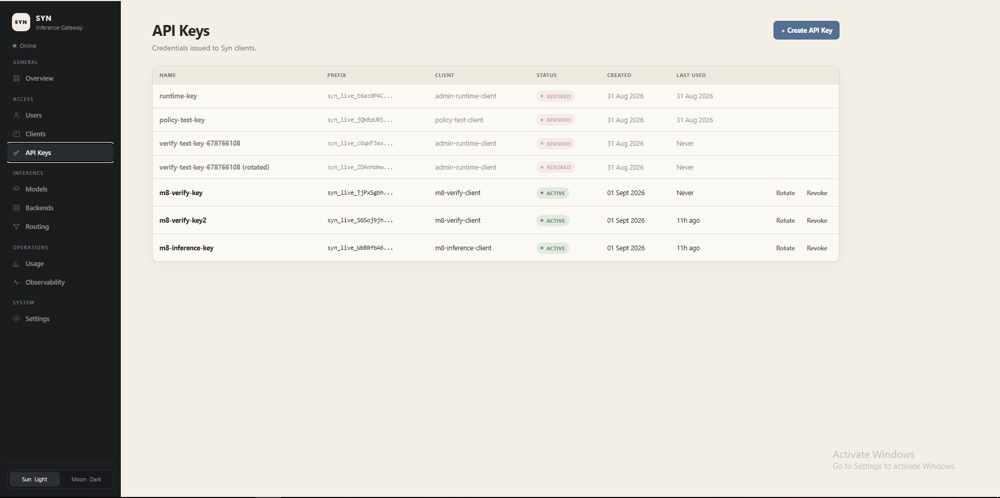

Create flows (custom dashboard modals, not native browser dialogs):

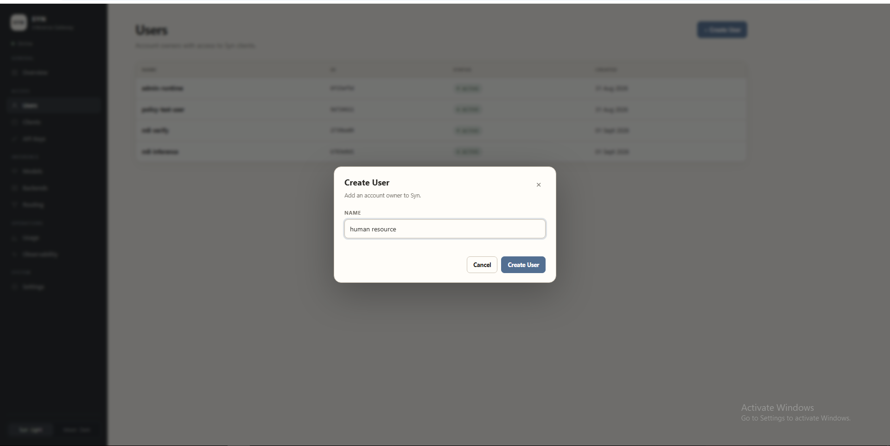
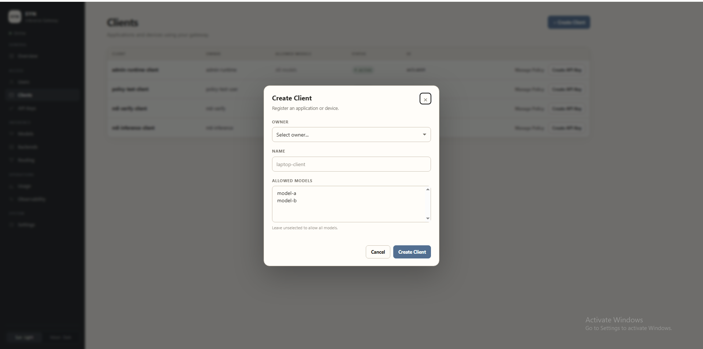
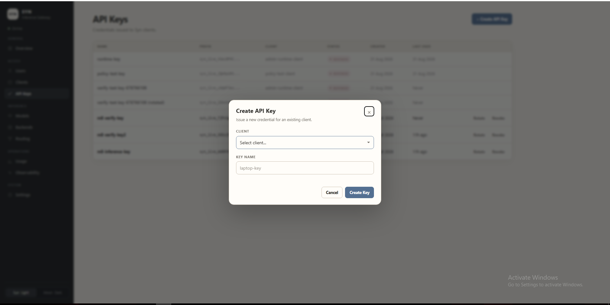

### Settings

Read-only runtime configuration grouped by NETWORK / ADMISSION / SECURITY / ROUTING.

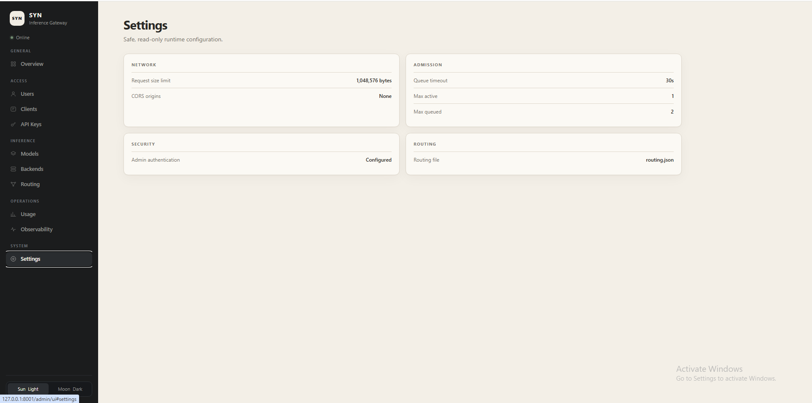

---

## Quick Start (local development)

Prerequisites: **Python 3.11+** and Git. M0 does not require llama.cpp, a GPU, or internet access.

```powershell
# 1. Clone and enter
git clone https://github.com/nirupamc/syn.git
cd syn

# 2. Create the project-local virtual environment
python -m venv .venv

# 3. Activate
.\.venv\Scripts\Activate.ps1
# (macOS/Linux: source .venv/bin/activate)

# 4. Install in editable mode with dev tools
pip install -e ".[dev]"

# 5. Configure (optional; safe dev defaults ship in .env.example)
Copy-Item .env.example .env
# Edit .env and set SYN_ADMIN_SECRET to a strong secret

# 6. Initialize the SQLite database
alembic upgrade head

# 7. Run the gateway
uvicorn app.main:app --host 127.0.0.1 --port 8001

# 8. Verify
Invoke-RestMethod http://127.0.0.1:8001/health
```

Open the admin UI at `http://127.0.0.1:8001/admin/ui` and enter the admin secret.

> For production, replace `SYN_ADMIN_SECRET` with a high-entropy secret. The dev `.env` value is for local testing only.

---

## One-click Launcher (Windows)

`START_SYN.cmd` and `STOP_SYN.cmd` orchestrate the full demo stack: **llama.cpp + Syn + Cloudflare Quick Tunnel**.

```powershell
# Full demo mode (llama.cpp + Syn + public Quick Tunnel)
START_SYN.cmd

# Local-only mode (no tunnel)
START_SYN.cmd --local

# Stop launcher-owned processes
STOP_SYN.cmd
```

The launcher:

1. Probes and reuses already-running llama.cpp / Syn (no duplicate processes)
2. Starts missing processes (llama.cpp on `127.0.0.1:8080`, Syn on `127.0.0.1:8001`)
3. Verifies backend reachability through Syn’s `/health`
4. If full mode and backend healthy: launches `cloudflared tunnel --url http://127.0.0.1:8001`
5. Captures the ephemeral `https://*.trycloudflare.com` URL and verifies public `/health` returns 200
6. Prints a clean summary

Safety:

- PID files in `.runtime/` (gitignored)
- Stale PID detection and cleanup
- `STOP_SYN.cmd` only stops **launcher-owned** processes — pre-existing llama.cpp / Syn instances are left running
- No global `taskkill /IM python.exe /F`

Configuration in `scripts/runtime.local.ps1` (gitignored template: `scripts/runtime.local.ps1.example`).

---

## OpenAI-compatible Usage

```python
from openai import OpenAI

client = OpenAI(
    base_url="http://127.0.0.1:8001/v1",
    api_key="YOUR_SYN_API_KEY",
)

response = client.chat.completions.create(
    model="model-a",
    messages=[
        {"role": "user", "content": "Hello from Syn"}
    ],
)

print(response.choices[0].message.content)
```

For streaming:

```python
stream = client.chat.completions.create(
    model="model-a",
    messages=[{"role": "user", "content": "Stream me a story"}],
    stream=True,
)
for chunk in stream:
    if chunk.choices[0].delta.content:
        print(chunk.choices[0].delta.content, end="", flush=True)
```

For remote access via a Quick Tunnel:

```python
client = OpenAI(
    base_url="https://<your-quick-tunnel>.trycloudflare.com/v1",
    api_key="YOUR_SYN_API_KEY",
)
```

The Quick Tunnel URL changes between sessions — it is an ephemeral demo-grade address, not a permanent production deployment.

---

## API Key Flow

1. Operator opens the admin UI and authenticates with the admin secret
2. Creates a **User** (account owner)
3. Creates a **Client** (application or device) under that user
4. Opens the **Create API Key** modal, selects the client by name, names the key
5. Plaintext key is shown **once** in a dedicated modal — must be copied immediately
6. Key is referenced by **prefix** + **hash** thereafter; plaintext is never stored, logged, or displayable again
7. **Rotate** issues a new key (old key revoked) and shows the new plaintext once
8. **Revoke** invalidates the key immediately; clients using it lose access at once

The listing endpoint never returns plaintext — only metadata (name, prefix, client, status, timestamps).

---

## Security Model

| Layer | Mechanism |
|-------|-----------|
| Data plane `/v1/*` | Bearer API key (hashed at rest with high-entropy key material) |
| Management plane `/admin/*` | `X-Admin-Secret` header (memory-only in browser) |
| Admin UI | Admin secret held in JS memory only; never `localStorage`, `sessionStorage`, cookies, or query params |
| API key plaintext | Shown once at create/rotate; never re-displayable; never logged |
| llama.cpp | Loopback-only (`127.0.0.1:8080`); never bound to a public interface |
| Syn local | `127.0.0.1:8001`; public access only via Cloudflare Tunnel |
| CORS | Explicit origin allowlist via `SYN_CORS_ALLOWED_ORIGINS`; wildcard `*` rejected; `allow_credentials=False` |
| Request size | `SYN_MAX_REQUEST_BODY_BYTES` (default 1 MiB) with `413` enforcement on `/v1/*` |
| Rate / quota | Identity-based (`api_key_id`), not IP-based; not fooled by `X-Forwarded-For` |
| Proxy headers | Syn does **not** trust `X-Forwarded-For` / `CF-Connecting-IP` for security decisions |
| Observability | Stores no prompts, no completions, no API keys, no Authorization headers |
| GGUF paths | Sanitized to basenames in admin responses |

Syn makes no enterprise-security claims. The single-shared-admin-secret model is deliberate at this stage; do not expose the admin plane over the public Internet without additional network controls (e.g. Cloudflare Access).

---

## Routing

Clients request models by **canonical Syn ID** or **alias**. Syn resolves to the configured backend and the backend-native model:

```
client requests:  model-a
Syn resolves:     model-a  →  backend-a  →  <runtime GGUF basename>
```

Aliases canonicalize **before** authorization, so an alias cannot be used to bypass model policy. When the configured backend is unavailable, Syn does **not** silently fall back to another backend or model — the request is rejected with a typed error.

Routing configuration lives in `config/routing.json`. Use `POST /admin/routing/preview` or the UI Routing page to preview a decision without sending a real request.

---

## Usage + Observability

For every request, Syn records (UTC, durable in SQLite):

- `started_at` / `completed_at`
- `status` (one of `completed`, `failed`, `cancelled`, `timed_out`, `rejected`)
- `prompt_tokens` / `completion_tokens` / `total_tokens` (nullable for cancelled/failed streams)
- `queue_wait_ms`, `backend_latency_ms`, `ttft_ms`, `stream_duration_ms`, `total_duration_ms`
- `request_id` (preserved through Cloudflare)

Percentile semantics: p50/p95 are true percentiles over observed values; `max` is the observed maximum; `avg` is the arithmetic mean.

No prompts or completions are stored. The Observability admin page renders recent requests with client-side filters for model and status.

---

## Project Structure

```
syn/
├── app/                    # FastAPI application
│   ├── api/                # /v1/* and /admin/* routes
│   ├── auth/               # API-key + admin-secret auth
│   ├── backends/           # backend abstraction (llama.cpp)
│   ├── routing/            # canonical model IDs, backend registry
│   ├── observability/      # latency / tokens / outcomes
│   ├── models/             # SQLAlchemy ORM
│   ├── core/               # config, errors, SSE, security
│   ├── templates/          # self-contained admin UI
│   └── main.py
├── config/                 # routing.json
├── docs/                   # ARCHITECTURE, ADMIN_UI, ROUTING, REMOTE_DEPLOYMENT
├── scripts/                # one-click launcher (start_syn.ps1, stop_syn.ps1)
├── tests/                  # pytest suite (no GPU / no network required)
├── gitimg/                 # README screenshots
├── deploy/                 # cloudflared.example.yml
├── pyproject.toml
└── README.md
```

---

## Testing

```powershell
# Full suite (no llama.cpp, no GPU, no network required)
pytest -q

# M10 admin UI tests only
pytest tests/test_admin_m10.py -q
```

Current verified state:

- **Full suite**: 442 passed / 0 failed
- **M10 admin UI**: 84 passed / 0 failed

Tests use `httpx.MockTransport` for backend behavior and a SQLite test database — no real llama.cpp, GPU, or network access is required.

---

## Milestone Status

| Milestone | Focus | Status |
|-----------|-------|--------|
| M0 | Architecture & Service Foundation | ✅ VERIFIED COMPLETE |
| M1 | Private llama.cpp Backend Integration | ✅ VERIFIED COMPLETE |
| M2 | OpenAI Chat Compatibility | ✅ VERIFIED COMPLETE |
| M3 | Users / Clients / API Keys | ✅ VERIFIED COMPLETE |
| M4 | Admission Control / Queue / Concurrency | ✅ VERIFIED COMPLETE |
| M5 | Streaming / Cancellation | ✅ VERIFIED COMPLETE |
| M6 | Usage / Quotas / Rate Limits | ✅ VERIFIED COMPLETE |
| M7 | Observability / Admin Dashboard | ✅ VERIFIED COMPLETE |
| M8 | Secure Remote Deployment (Cloudflare) | 🟡 IN PROGRESS |
| M9 | Multi-Model / Multi-Backend Routing | ✅ VERIFIED COMPLETE |
| M10 | Admin Control Plane UI | ✅ VERIFIED COMPLETE |

> A milestone is never declared complete merely because code exists. The only allowed statuses are `NOT STARTED`, `IN PROGRESS`, and `VERIFIED COMPLETE`.

### M8 — IN PROGRESS

What is verified:

- Quick Tunnel dials out from `127.0.0.1:8001` to `https://*.trycloudflare.com`
- Remote `GET /health` works through the tunnel
- Remote `Authorization: Bearer` auth works
- Remote non-streaming `chat.completions` works
- `413 request_body_too_large` enforcement works remotely
- Remote observability works
- Tunnel-stop behavior is clean (local Syn keeps running)
- `llama.cpp` remains loopback-only; raw `host:8080` is unreachable

Still open in M8:

- Stable named tunnel / permanent domain
- True incremental remote SSE verification (end-to-end, multi-chunk, `[DONE]`)
- External raw-port negative proof audit

The Quick Tunnel is intended for **testing, portfolio demos, and temporary remote access**. It is not a permanent production deployment.

---

## Current Limitations

- **No** tool / function calling, `response_format`, or `logprobs`
- **No** distributed mode — admission controller, rate limiter, and observability aggregates are process-local; run with `--workers 1` (the default)
- The admin plane uses a single shared bootstrap secret, not a full RBAC system
- The public API is a **deliberate subset** of OpenAI compatibility — Syn is not a full clone
- Cancellation guarantee: Syn closes the upstream HTTP connection and releases the admission slot; whether llama.cpp stops GPU generation immediately is implementation-dependent
- Token quota is boundary-enforced: the current request may exceed the daily limit by one generation
- No bundled external Prometheus/Grafana/OpenTelemetry collector — `/admin/metrics` is ready for scraping
- Single-tenant by design; multi-tenant routing/quotas are out of scope

---

## Roadmap

| Next | Focus |
|------|-------|
| M8 close-out | Stable remote tunnel, full incremental SSE proof, raw-port audit |
| Beyond | Stable multi-worker mode, multi-tenant policy, bundled observability stack |

---

## License

MIT
